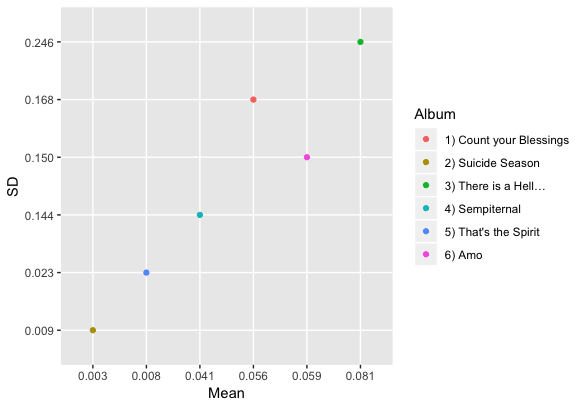
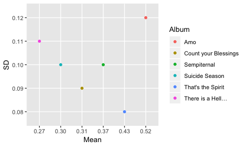
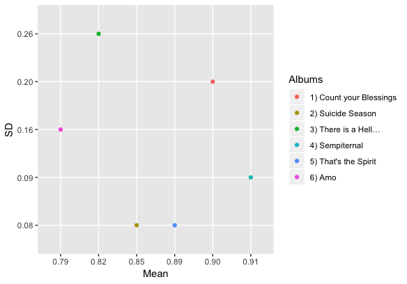
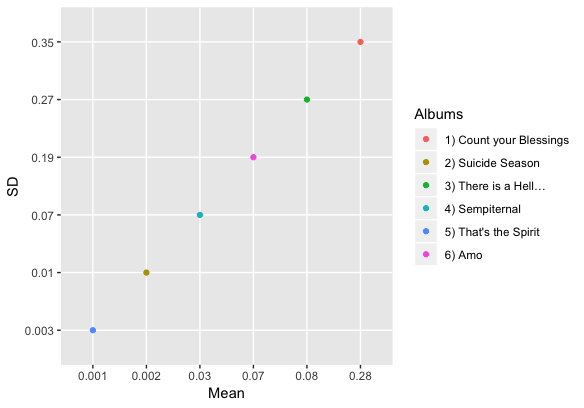
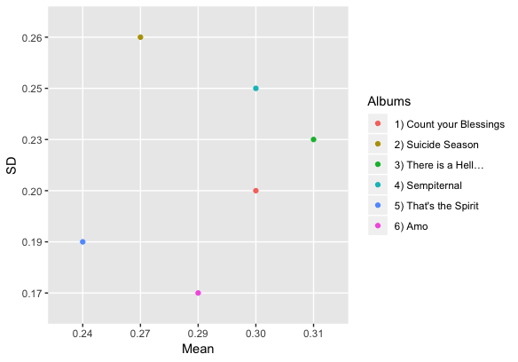
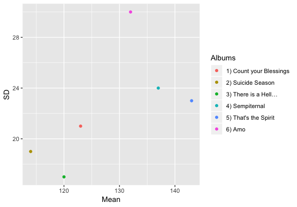
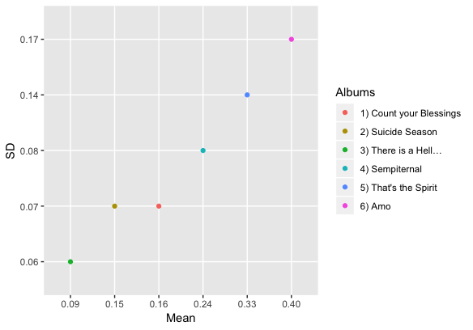

# Portfolio Computational Musicology

## Introduction 

The rock/metal band Bring Me The Horizon released their sixth album *amo* on the 25th of January 2019. The reaction on the new album is divided. The sound of this album is totally different than fans are used to hearing from them. It feels like they are stepping out of their 'heavy metal' image and taking on a new one. One song called 'heavy metal' of Bring Me The Horizon's new album talks about their change in genre and the reaction of their fans:

*"And I keep picking petals/
I'm afraid you don't love me anymore/
'Cause a kid on the 'gram in a Black Dahlia tank/
Says it ain't heavy metal"*

I want to know if their new album is really that different from the other albums and what the difference is exactly. Is it true that they are changing their image and what are they changing it to? My research question is therefore: Is Bring Me The Horizon creating a new musical image and what is this image exactly?

## Method

To anwer my research question I'm using a handfull of different Spofity playlists to compare their features. My main corpus is obviously Bring Me The Horizon's newest album *amo*. Besides that I'm also looking into all their old albums: *Count Your Blessings*, *Suidice Season*, *There is a Hell Believe Me I've Seen it. There is a Heaven Let's Keep it a Secret*, *Sempiternal* and *That's the Spirit*. To get the Spotify features for the albums, I've make seperate playlist for each. With the help of these albums I can compare the new album to their old ones and see if there are differences and similarities. I'm not only doing this between albums, but also with genres. I'm using different Spotify playlists to compare them to the albums and see which genre fits the best per album. The playlist I'm using for this are: Rock Classics, Pure Pop Punk, Heavy Metal, Pop Internacional and Ultimate Indie. By using the Bring Me The Horizon albums and the genre playlist, I hope to answer my research question. 

## Album Features

### Acousticness 

For Spotify 'Acousticness' means if a track is acoustic and is calcultated on a scale from 0 to 1, one having a high confidence that the track is acoustic. As seen in the graph below, there is a lot of difference between the acousticness of the different albums. The second album *Suicide Season* scores the lowest (M = 0.003 and SD = 0.01) and the third album *There is a Hell...* has the highest score (M = 0.08 and SD = 0.25). Further there is no 'logical' order of the rest of the albums, so newer and older albums not arranged in order. 

### Danceability

Unlike acousticness, danceability has some interessting results regarding their scoring order. Here *There is a Hell...* scores the lowest(M = 0.27 and SD = 0.11), while the newest album *Amo* has the highest mean (M = 0.52 and SD = 0.12). What is interessting with this feature is the difference in mean between an album and the next one. Between the first and the third album there is a difference of 0.04 in mean and 0.02 in the standard deviation. When looking at the newer albums, between the fourth and the sixth there is a difference of 0.15 for the mean (and 0.02 for SD). The difference is almost four times as big, so the danceability in the later albums have increased a lot in comparison with the older albums. 

### Energy

### Instrumentalness 

### Liveness

### Tempo

### Valence

With valence the albums are arranged in the exact same order as they did for danceability. The third album bottom and the newest on top. The difference between those two albums are way bigger than for danceability. Here the lowest score is 0.09 (for the mean and 0.06 for SD) and the highest has a mean of 0.40 (and a SD of 0.17). Spotify describes valence as the positiveness conveyed by a track, where the higher the score the more positive (e.g. happy, cheerful, euphoric) it is. Because of this we can say that the new album *amo* is definately more positive, but in comparison to the whole scale of valence all the albums are on the negative (e.g. sad, depressed, angry) side. Therefore the feeling of the songs throughout different have not changed dramatically, although it has become more positive over the years. 

## Genre Features 

### Heavy Metal

### Indie

### Pop

### Pop Punk

### Rock

